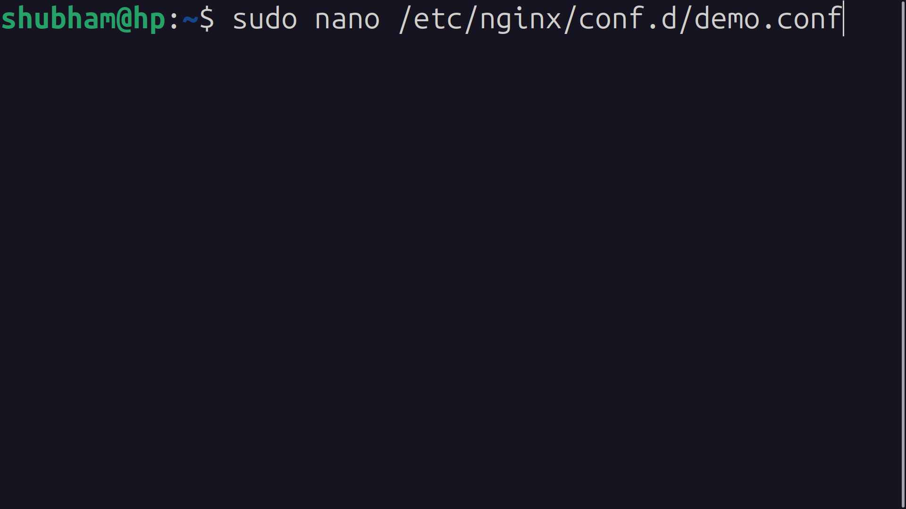

# Nginx Project: CCD (Clone, Configure, Deploy) Deployment

## Overview

This guide outlines the steps to deploy a web application using Nginx on an AWS EC2 instance. The process includes setting up the EC2 instance, installing and configuring Nginx, and deploying the application using Git.

## Prerequisites

- AWS account with permissions to launch EC2 instances
- SSH access to the EC2 instance
- A domain name (optional but recommended)
- Git repository with the web application code

## Deployment Steps

### 1. Launch an EC2 Instance

- Go to AWS Console > EC2 > Launch Instance.
- Choose an appropriate Amazon Machine Image (AMI) (e.g., Ubuntu 20.04).
- Select instance type (e.g., `t3.micro` for free tier eligibility).
- Configure security group to allow HTTP (port 80) and SSH (port 22).
- Launch the instance and note the public IP address.

<kbd></kbd>

### 2. Connect to the Instance via SSH

<kbd></kbd>

```sh
ssh -i your-key.pem ubuntu@your-ec2-public-ip
```

### 3. Update and Install Nginx

<kbd></kbd>

```sh
sudo apt update && sudo apt upgrade -y
sudo apt install nginx -y
```

### 4. Navigate to the Web Root Directory & clone repo

<kbd></kbd>

```sh
cd /var/www/html
sudo git clone https://github.com/shubhamMca88/ccd-clone.git
sudo rm -rf *  # Remove default index.html if needed
```

### 5. Configure Nginx 

Create a new configuration file for the site (for best practice):

<kbd></kbd>

```sh
sudo nano /etc/nginx/conf.d/demo.conf
```

Add the following configuration:

```nginx
server {
    listen 80;
    server_name example.com www.example.com;  #your dns ip 

    root /var/www/html/ccd-clone;
    index index.html index.htm index.php;

    location / {
        try_files $uri $uri/ =404;
    }

    error_log /var/log/nginx/my_site_error.log;         # Error log file
    access_log /var/log/nginx/my_site_access.log;       # Access log file
}
```

Enable the configuration:

```sh
sudo ln -s /etc/nginx/sites-available/yourdomain.conf /etc/nginx/sites-enabled/
```

### 6. Test Nginx Configuration

<kbd></kbd>

```sh
sudo nginx -t
```

If successful, restart Nginx:

```sh
sudo systemctl reload nginx
sudo systemctl daemon-reload  # if server not run
```

### 7. Verify Deployment

- Open a browser and navigate to `http://your-ec2-public-ip` or `http://yourdomain.com`.

<kbd></kbd>

---

### Notes:

- If using a domain, update your DNS records to point to the EC2 public IP.
- For SSL, install Certbot and configure HTTPS.

```sh
sudo apt install certbot python3-certbot-nginx -y
sudo certbot --nginx -d yourdomain.com -d www.yourdomain.c
```
